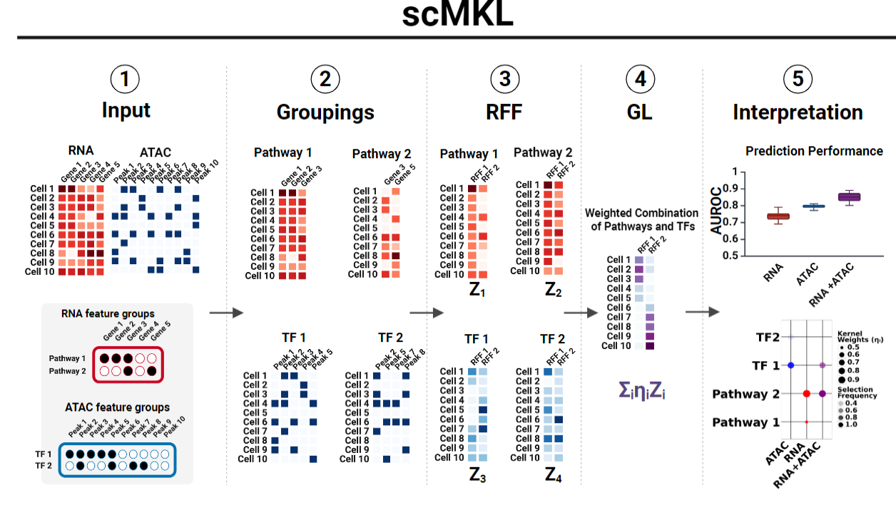

# Benchmarking single-cell analysis with Multiple Kernel Learning (scMKL)



This repository contains the code necessary to reproduce the work in our paper 
**Interpretable and Integrative Analysis of Single-Cell Multiomics with 
scMKL**. See the description below.

scMKL is now a package! Check out the package repository on 
[GitHub](https://github.com/ohsu-cedar-comp-hub/scMKL) for installation 
instructions.


### [Performance_Comparisons](Performance_Comparisons)

This directory contains the scripts used to run XGBoost, MLP, and SVM for 
comparing to scMKL classification performance.


### [Scalability_Comparisons](Scalability_Comparisons)

This directory contains the scripts used to run scMKL, EasyMKL, XGBoost, MLP, 
and SVM for resource usage comparisons.


### [env_ymls](env_ymls)

This directory contains all the environments used to generate data for our 
publication.


### Citation
If you use scMKL in your research, please cite using:
```
To be determined
```
Our Shiny for Python application for viewing data produced from this work can be found here: [scMKL_analysis](https://huggingface.co/spaces/scMKL-team/scMKL_analysis)